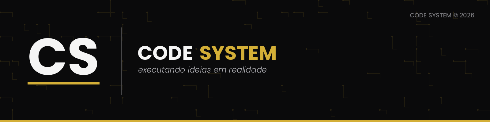
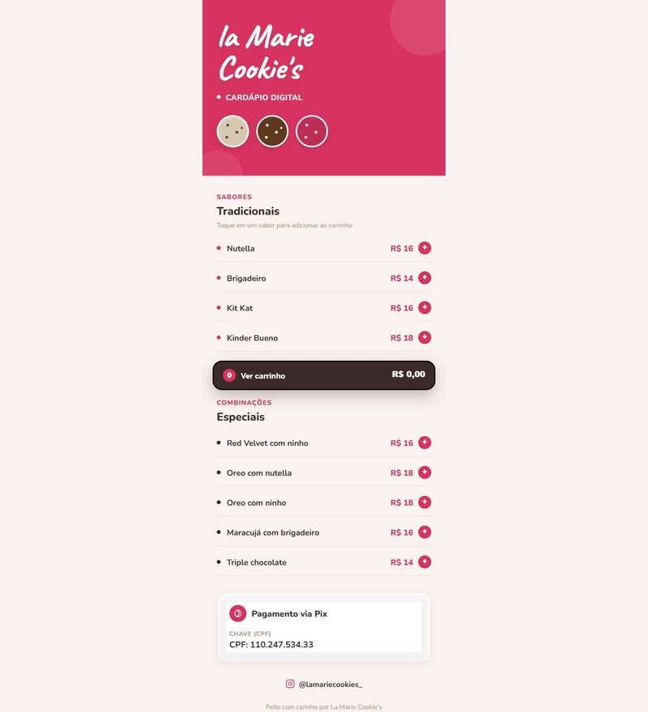
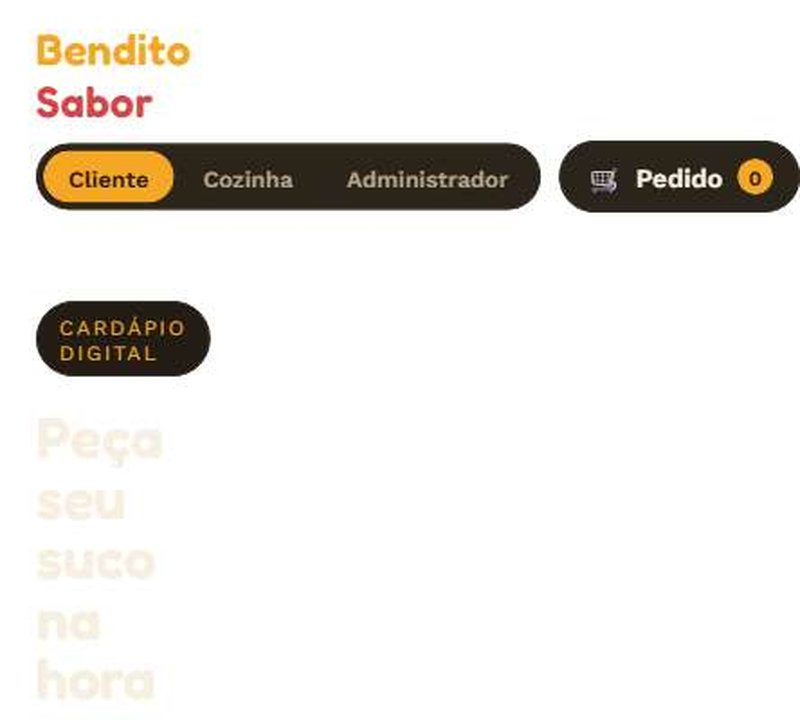
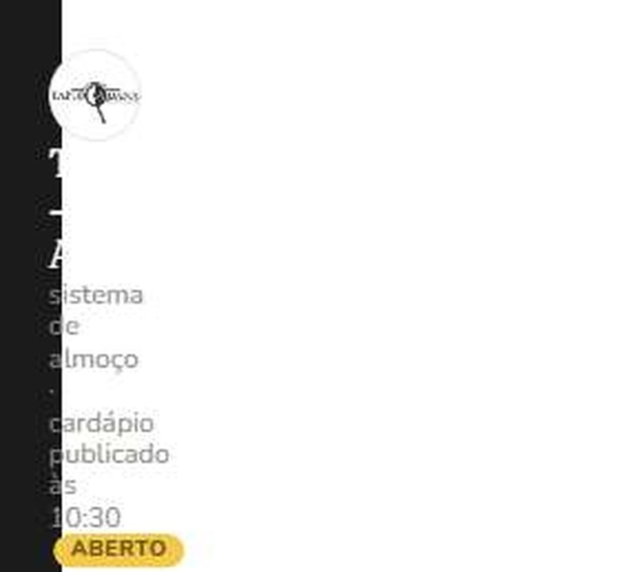
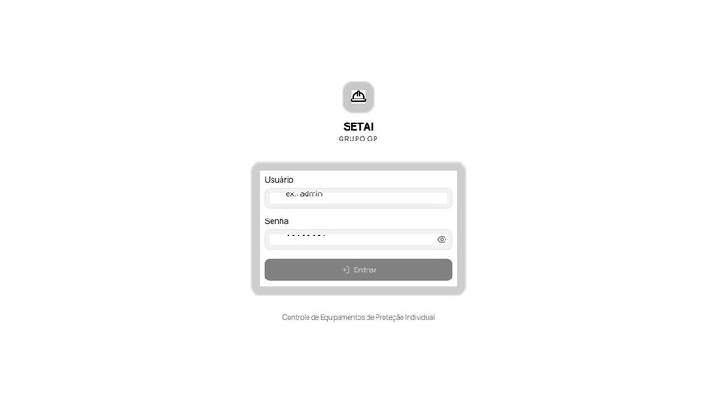
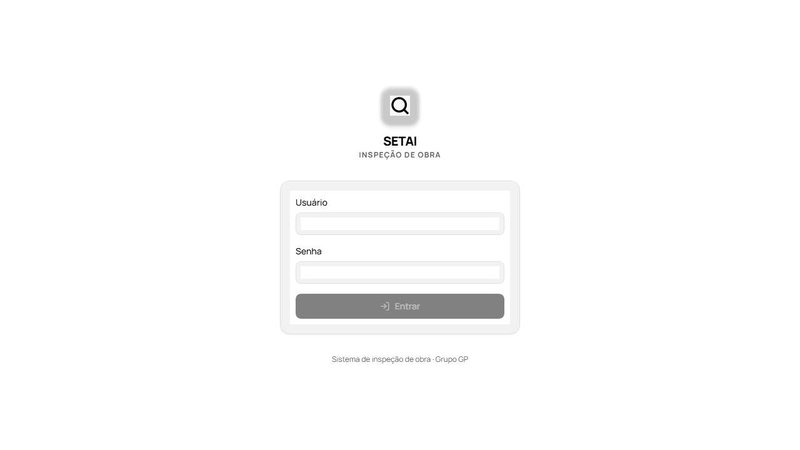

# 🗂️ Portfólio CODE SYSTEM

### *executando ideias em realidade*

Sistemas web sob medida — cardápios digitais, painéis administrativos e ferramentas internas, do zero ao ar.

---

## 👋 Sobre a CODE SYSTEM

A **CODE SYSTEM** é uma dupla de desenvolvimento fundada por **Daniel Medeiros** e **Henrique Dantas**, estudantes de Ciência da Computação que constroem sistemas web sob medida para pequenos negócios e empresas parceiras — do cardápio digital que substitui a fila no balcão até o painel interno que organiza o estoque de uma equipe inteira.

Este repositório reúne, em formato de estudo de caso, alguns dos sistemas que já colocamos no ar. Os projetos aqui são **privados** para os clientes (código-fonte e dados ficam protegidos) — este README existe só para mostrar o que construímos e como construímos.

## 🛠️ Stack

---

## 📁 Projetos

### 🍪 La Marie Cookie's — Cardápio Digital

Cardápio digital para uma loja de cookies artesanais: o cliente monta o pedido pelo celular antes mesmo de chegar ao balcão, sem precisar decidir na fila.

- 🔗 Sistema em produção: [la-marie-cookies.setaisst.workers.dev](https://la-marie-cookies.setaisst.workers.dev/)
- **Stack:** React · Vite · TailwindCSS · Cloudflare Workers

---

### 🍔 Bendito Sabor — Cardápio Digital

Cardápio digital para uma lanchonete com sucos naturais, burgers artesanais, pastéis e pizzas — pedido pelo celular, retirada no balcão, sem fila.

- 🔗 Sistema em produção: [bendito-sabor.setaisst.workers.dev](https://bendito-sabor.setaisst.workers.dev/)
- **Stack:** React · Vite · TailwindCSS · Cloudflare Workers

---

### 🌮 Tapiocabana — Sistema de Almoços

Sistema de pedidos de almoço para alunos e funcionários: cardápio do dia com prato principal montável (proteína + acompanhamentos), tapiocas, lanches e bebidas, tudo no mesmo pedido.

- 🔗 Sistema em produção: [tapiocabana-almocos.setaisst.workers.dev](https://tapiocabana-almocos.setaisst.workers.dev/)
- **Stack:** React · Vite · TailwindCSS · Hono · Drizzle · Neon Postgres · Cloudflare Workers

---

### 🦺 SETAI — Controle de EPIs

Painel administrativo para controle de Equipamentos de Proteção Individual da equipe: cadastro de funcionários e EPIs, estoque, entregas, treinamentos e vencimentos, com dashboard de visão geral.

- 🔗 Sistema em produção *(acesso restrito à equipe)*
- **Stack:** React · Vite · TailwindCSS · Hono · Drizzle · Neon Postgres · Cloudflare Workers

---

### 🏗️ SETAI — Inspeção de Obra

Sistema próprio para inspeção de obra: registro de vistorias, ordens de serviço e documentação de segurança do trabalho (ASOs), substituindo o controle manual em planilha.

- 🔗 Sistema em produção *(acesso restrito à equipe)*
- **Stack:** React · Vite · TailwindCSS · Hono · Drizzle · Neon Postgres · Cloudflare Workers

---

### 📋 CRM CODE SYSTEM — Uso Interno

CRM próprio, construído para organizar os projetos e clientes da própria CODE SYSTEM.

- **Stack:** React · Vite · TailwindCSS · Hono · Drizzle · Neon Postgres · Cloudflare Workers

---

### 🍽️ Delícias da Maré — Cardápio Digital *(em preparação)*

Cardápio digital para um restaurante, seguindo o mesmo formato de pedido pelo celular. Sistema pronto; deploy pendente da provisão final de banco de dados e domínio.

- **Stack:** React · Vite · TailwindCSS · Hono · Drizzle · Neon Postgres · Cloudflare Workers

---

## 📬 Contato

Quer um sistema assim para o seu negócio? Fala com a gente:

Desenvolvido por **CODE SYSTEM** 🚀

